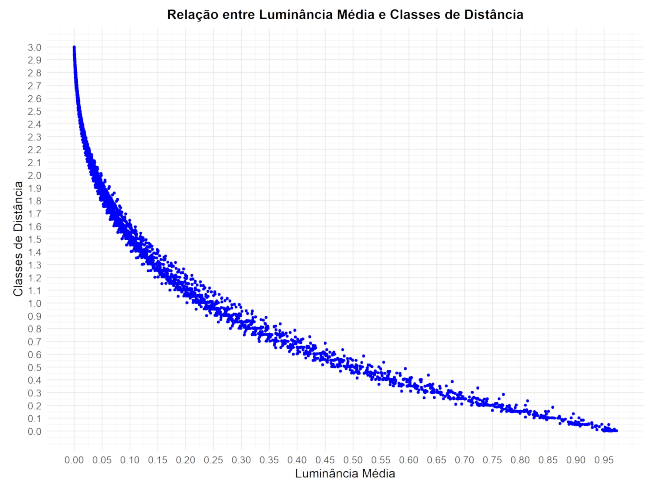
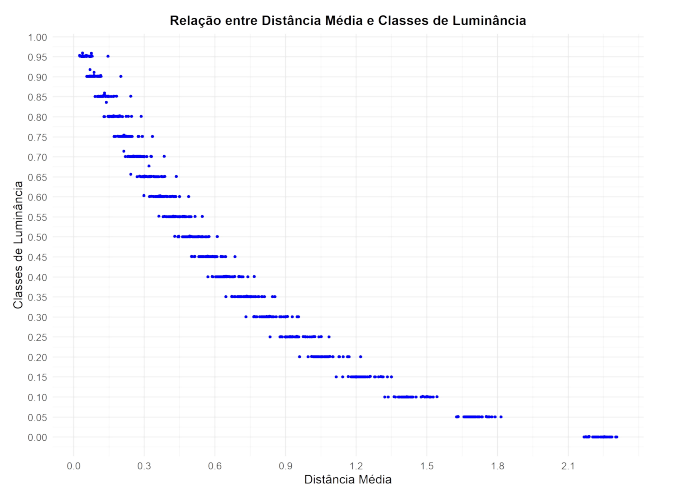

# Report on Distance and Luminance Data in the RGB Color Space
Data analysis project that aims to establish a relation between the Canberra distance between white and any given color in the RGB color space and its luminance. 

# Introduction

This project investigates the relationship between the Canberra distance of colors to white and their relative luminance. For this, a sample of 45 still-life images was used, extracted from the Web Gallery of Art database. The analysis was conducted using a Python algorithm that extracted and processed the color data.

## Image Dataset

The images used belong to three distinct periods: 1601-1650, 1701-1750, and 1851-1900. Each subgroup contains five works by three different artists, without nationality repetition within the period.

## Color Space and Distance Metric

The RGB color space was chosen due to its wide usage and ease of manipulation. The Canberra metric was used to measure the distance between colors, as it showed good results in image segmentation.

## Methodology

* Color Segmentation: colors were grouped based on the Canberra distance to white (255, 255, 255).

* Data Extraction: each image generated two CSV files containing distance and luminance data.

* Organization and Standardization: the data was unified into general files to facilitate statistical analysis.

* Statistical Analysis: the distributions of distance and luminance classes were explored, along with the calculation of Spearman correlation.

# Results

The results indicate a strong negative correlation between the Canberra distance and the relative luminance of colors. Statistical tests confirmed this correlation, suggesting that the human intuition of "proximity to white" is based on quantifiable characteristics.

## Graphs

### Mean Luminance x Distance Classes

### Mean Distance x Luminance Classes

# Conclusion

The study demonstrated that the Canberra distance is a good indicator of the relative luminance of colors in the RGB space. Future analyses could expand the image sample and explore other metrics to improve color segmentation models.

# References

* Web Gallery of Art: https://www.wga.hu/

* Luminance Documentation: https://www.101computing.net/

